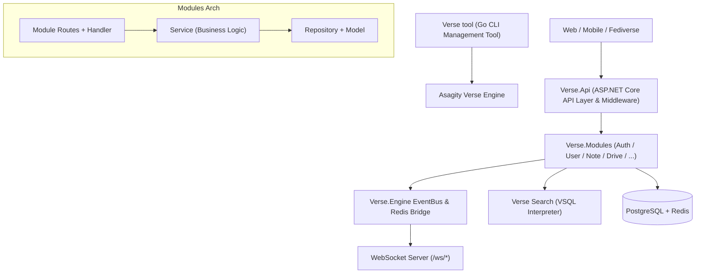

# 🩵 Asagity Verse (Server)

> **The Cyan-tinted Decentralized Social Universe — Backend Core Engine**

Asagity Verse is the backend server engine for the Asagity platform, powered by a dual-engine architecture combining **Go (Core Engine & Toolchain) + ASP.NET Core (API & Module Layer)**. Built on a **self-developed decoupled Module + App Environment design (Modular Monolith + App Environment / AAP)** and **Clean Architecture** principles, it integrates native federation (ActivityPub / Verse Protocol), high-performance real-time push, the in-house VSQL search interpreter, and the Skyline Drive multi-backend cloud storage system.

---

## 🎨 Architectural Principles & Module + App Environment Philosophy

1. **Self-Developed Module + App Environment Design (Verse.Modules + AAP)**:
   - Business capabilities are decoupled into independent **core modules** (e.g. `Auth`, `User`, `Note`, `Drive`, `Follow`, `Instance`, `Music`).
   - Each core module owns its REST API route mounting, data Model/Repository, and Event subscription logic, achieving high cohesion, low coupling, and plug-and-play.
   - Third-party developers no longer write "modules". Instead, they build **Apps** on top of the **App Environment**: distributed as `.aap` (Asagity Application) packages, running in a sandboxed application runtime with only restricted APIs and EventBus subscriptions — no direct database access (see the "📦 Module vs App Boundary" section).
2. **Dual-Engine Layering (Go + ASP.NET Core)**:
   - **ASP.NET Core (API & Modules layer)**: Responsible for RESTful APIs, middleware routing, type-safe model binding, dependency injection, and business-domain isolation.
   - **Go (Core Engine)**: Powers the high-performance EventBus, persistent-connection push, ActivityPub federation adapters, and the VSQL semantic interpreter.
3. **Event-Driven & Hook Mechanism**:
   - Hard-coded strong dependencies between modules are forbidden. Modules decouple via the Go Core EventBus & Redis EventBridge (e.g. publishing a post fires a `note.created` event that other modules freely subscribe to).
4. **In-House Search & VSQL Interpreter**: Drops third-party search dependencies in favor of an in-house search mechanism integrated with the **Verse Search Query Language (VSQL)** semantic interpreter, supporting multi-language CJK tokenization, Pinyin retrieval, and complex conditional expression parsing.
5. **Unified CLI Management (Verse tool)**: The lifecycle of Asagity Verse (start, stop, module/app loading, environment self-healing) is managed via **Verse tool** — a lightweight CLI ops tool written in Go.

---

## 📁 Refactored Directory Structure

```text
core/
├── src/
│   ├── Verse.slnx                       # .NET solution (Api + 7 Modules)
│   ├── Verse.Api/                        # 🚀 ASP.NET Core (API layer entrypoint)
│   │   ├── Program.cs                    # Dynamically scans and loads Modules
│   │   ├── Middlewares/                  # JWT auth, CORS, VSQL route-resolving middleware
│   │   └── Verse.Api.csproj
│   │
│   ├── Verse.Shared/                     # 🧩 Shared contracts (envelope/auth context/ModuleException)
│   │   └── Verse.Shared.csproj
│   │
│   ├── Verse.Modules/                    # 🧩 Self-developed modular business domains
│   │   ├── Verse.Module.Asset/           # Remote asset proxy & cache (Icon Proxy & Cache)
│   │   ├── Verse.Module.Auth/            # Auth module (Login, Register, OTP, Device Trust)
│   │   ├── Verse.Module.User/            # User module (Profile, pubid, Groups)
│   │   ├── Verse.Module.Note/            # Post/Timeline module (Posts, Repost, Reactions, Trees)
│   │   ├── Verse.Module.Drive/           # Skyline Drive module (Local/S3/WebDAV)
│   │   ├── Verse.Module.Follow/          # Social graph (Follow, Block, Mute)
│   │   ├── Verse.Module.Instance/        # Instance metadata & Federation health
│   │   └── Verse.Module.Music/           # Music player & LRC lyrics module (AAP app extension sample)
│   │
│   ├── Verse.Engine/                     # ⚙️ Go core engine (events/connections/VSQL/federation)
│   │   ├── cmd/verse-engine/             # Go engine daemon entrypoint
│   │   ├── pkg/
│   │   │   ├── eventbus/                 # High-performance EventBus & Redis Bridge
│   │   │   ├── vsql/                     # Verse Search Query Language semantic interpreter
│   │   │   ├── activitypub/              # ActivityPub & NeoLinkage federation adapters
│   │   │   └── websocket/                # Persistent-connection push service (/ws/timeline, /ws/global)
│   │   ├── go.mod
│   │   └── go.sum
│   │
│   └── Verse.Cli/                        # 🛠️ Verse tool (Go-based CLI management tool)
│       ├── cmd/verse/                    # `verse` CLI entrypoint (start, stop, status, module)
│       ├── internal/
│       │   ├── runner/                   # Dual-process (API + Engine) scheduling & supervision
│       │   ├── doctor/                   # Environment & database self-healing diagnostics
│       │   └── modulemgr/                # AAP application management
│       ├── go.mod
│       └── go.sum
│
├── storage/                              # Persistent storage & Migrations
│   ├── migrations/                       # PostgreSQL schema evolution scripts
│   └── scripts/                          # Ops helper scripts
│
├── README.md                             # English documentation
├── README_CN.md                          # Chinese documentation
└── Arch.mermaid                          # Modular backend architecture diagram
```

---

## 🧱 Modular Business Domains (`Verse.Modules`)

| Module package | Description |
| :--- | :--- |
| **`Verse.Module.Auth`** | Registration/login, 6-digit email OTP, JWT verification (30-min Access Token + 30-day Cookie Refresh Token rotation), device trust and global logout. |
| **`Verse.Module.User`** | User profiles, permission-group management, and Asagity's unique `pubid` (globally unique `usr_`-prefixed identifier, changeable monthly). |
| **`Verse.Module.Instance`** | Health checks (`GET /healthz`), version and instance metadata exposure (`/api/meta/instance`). |
| **`Verse.Module.Drive`** | Skyline Drive cloud system: chunked uploads and directory management across Local Disk, S3 object storage, and WebDAV mounts. |
| **`Verse.Module.Note`** | Social core: long/short posts, pure reposts, quote reposts, unlimited Emoji reactions, tree-structured reply chains, and VSQL search. |
| **`Verse.Module.Follow`** | Follow/follower graph and mute/block management. |
| **`Verse.Module.Music`** | Music player, LRC lyrics parsing and audio-quality tags, showcasing AAP app extensibility. |
| **`Verse.Module.Asset`** | Remote asset proxy & cache: fetches federated remote icons, caches them on disk by MD5. |

---

## 📦 Module vs App Boundary (Innovation)

The Asagity backend adopts a **"Module + App Environment"** two-tier extension system. Please note the terminology:

- **Module**: Refers only to **core modules** compiled with the server and maintained by the official team (`Auth / User / Note / Drive / Follow / Instance / Music` under `Verse.Modules`). Core modules enjoy full data-access and route-mounting capabilities under a unified in-module layering convention.
- **App (Application)**: Refers to extensions built by **third-party developers**, always called "Apps", never "modules". Apps are distributed as `.aap` (Asagity Application — essentially a tar.gz archive containing `manifest.json`, frontend/backend code, and static assets) packages, verified by signature and installed into the **App Environment**. The App Environment provides UI injection points (navbar, sidebar, timeline, floating buttons, etc.) plus restricted APIs/Event subscriptions. Apps are **forbidden from accessing the database directly** and may only use gated platform interfaces, keeping the core service secure and stable.
- The former **AIM (Asagity Integrated Module)** name and its `.aim` extension have been renamed to **AAP (Asagity Application)** and the `.aap` extension. See [`docs/file-format/aap.md`](../docs/file-format/aap.md) (formerly `aim.md`) for the full application package specification.

---

## 🛠️ Infrastructure & Core Engine (`Verse.Engine`)

- **PostgreSQL + ORM (`storage/migrations`)**: PostgreSQL is the primary database, deeply leveraging its `JSONB` features to parse and store heterogeneous ActivityPub federation data.
- **Redis (Cache / Queue / Bridge)**: Handles hot caches, token-refresh blacklist/rotation storage, EventBridge message pipelines, and task queues.
- **Go In-Memory EventBus & Redis Bridge (`Verse.Engine/pkg/eventbus`)**:
  - **In-Memory EventBus**: Configured with 16 worker goroutines and **idempotency dedup over 100k records**.
  - **Redis EventBridge**: Syncs events across server nodes via Redis Pub/Sub, building cluster-wide broadcast capability.
- **WebSocket Push Server (`Verse.Engine/pkg/websocket`)**: Multi-channel subscriptions (`/ws/timeline` timeline, `/ws/notifications` notifications, `/ws/global` global events).
- **In-House Search Engine & VSQL Interpreter (`Verse.Engine/pkg/vsql`)**:
  - **In-House Search**: Paired with the **Verse Search Query Language (VSQL)** semantic interpreter to parse rich text, conditional syntax expressions, and logical matching.
  - **Multi-Language & Pinyin**: Supports Chinese full Pinyin/initial-letter association, CJK smart tokenization, and complex search syntax.

---

## 🛠️ Management Tool: Verse tool (`Verse.Cli`)

The Asagity Verse server lifecycle is uniformly managed by **Verse tool** (a Go-based CLI management tool):
- **Service Control**: `verse start` / `verse stop` / `verse restart` / `verse status`
- **App Management**: `verse app list` / `verse app enable` / `verse app disable` (manage third-party `.aap` apps)
- **Environment Checks**: Diagnoses PostgreSQL, Redis, network ports, and environment connectivity.

---

## 🗺️ Architecture Diagram

See [Arch.mermaid](./Arch.mermaid) in this directory for the detailed architecture diagram.



---

## 🔧 Running & Maintenance

The lifecycle and ops commands of Asagity Verse are uniformly scheduled by **Verse tool**:

```bash
# Start the full Asagity Verse server stack (API + Engine)
verse start

# Show service runtime and module/app loading status
verse status

# Stop services
verse stop
```

The API listens on `:2048` by default. You can verify server status by visiting `http://localhost:2048/healthz`.
